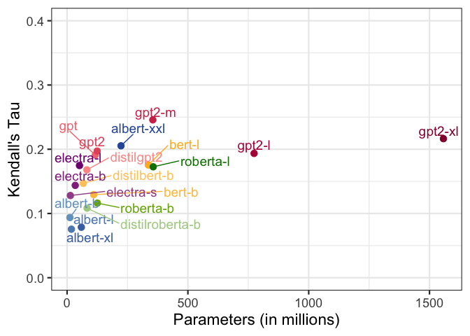

Analysing Typicality Effects in LMs
================

## Loading Data

``` r
model_meta <- read_csv(here::here("data/meta.csv")) %>%
  mutate(
    model = str_remove(model, "(google_)"),
    model = str_remove(model, "\\-generator"),
    model = str_remove(model, "\\-uncased"),
    model = str_replace(model, "large", "l"),
    model = str_replace(model, "medium", "m"),
    model = str_replace(model, "small", "s"),
    model = str_replace(model, "base", "b"),
    model = str_replace(model, "openai\\-", ""),
    model = str_replace(model, "\\-v1", "")
  ) 

levels = c('5gram', 'albert-b', 'albert-l', 'albert-xl', 'albert-xxl', 'distilbert-b', 'bert-b', 'bert-l', 'electra-s', 'electra-b', 'electra-l', 'distilgpt2', 'gpt', 'gpt2', 'gpt2-m', 'gpt2-l', 'gpt2-xl', 'distilroberta-b', 'roberta-b', 'roberta-l')

colors <- c('grey', '#73a2c6','#5d8abd','#4771b2','#2e59a8','#ffca68','#ffc14c','#fdb827','#92338c','#800080','#a35298','#ff9895','#f4777f','#e4576b','#cf3759','#b41648','#93003a','#adcf90','#75af00','#008000')

frequencies <- read_csv(here::here("data/frequencies/wikicounts.csv")) %>%
  rename(item = word)

typicality_ratings <- dir_ls(here::here("data/rosch1975/results/rosch1975/"), regexp = "*.csv") %>%
  map_df(read_csv) %>%
  mutate(
    model = str_remove(model, "(google_)"),
    model = str_remove(model, "\\-generator"),
    model = str_remove(model, "\\-uncased"),
    model = str_replace(model, "large", "l"),
    model = str_replace(model, "medium", "m"),
    model = str_replace(model, "small", "s"),
    model = str_replace(model, "base", "b"),
    model = str_replace(model, "openai\\-", ""),
    model = str_replace(model, "\\-v1", "")
  ) %>%
  group_by(model, category) %>% 
  mutate(rank = row_number()) %>%
  ungroup()

ngram <- typicality_ratings %>% 
  filter(model == "5gram") %>%
  rename(ngram_score = score) %>%
  select(-stimulus, -model, -params)

# typicality_ratings <- typicality_ratings %>%
#   filter(model != "5gram")

induction <- dir_ls(here::here("data/results/premiseconclusion/"), regexp = "*.csv") %>%
  map_df(read_csv) %>%
  mutate(
    model = str_remove(model, "(google_)"),
    model = str_remove(model, "\\-generator"),
    model = str_remove(model, "\\-uncased"),
    model = str_replace(model, "large", "l"),
    model = str_replace(model, "medium", "m"),
    model = str_replace(model, "small", "s"),
    model = str_replace(model, "base", "b"),
    model = str_replace(model, "openai\\-", ""),
    model = str_replace(model, "\\-v1", "")
  ) %>%
  group_by(model, category, predicate_id, argument_id) %>% 
  mutate(rank = row_number()) %>%
  ungroup() %>%
  mutate(
    item = case_when(item == "brussel" ~ "brussels sprouts", TRUE ~ item)
  )

feature_overlaps <- dir_ls(here::here("data/rosch1975/results/rosch1975_features/"), regexp = "*.csv") %>%
  map_df(read_csv) %>%
  mutate(
    model = str_remove(model, "(google_)"),
    model = str_remove(model, "\\-generator"),
    model = str_remove(model, "\\-uncased"),
    model = str_replace(model, "large", "l"),
    model = str_replace(model, "medium", "m"),
    model = str_replace(model, "small", "s"),
    model = str_replace(model, "base", "b"),
    model = str_replace(model, "openai\\-", ""),
    model = str_replace(model, "\\-v1", "")
  )

ngram_fo <- feature_overlaps %>% 
  filter(model == "5gram") %>%
  rename(ngram_feature_score = score) %>%
  select(-stimulus, -model, -params)
```

# ngram correlaion

``` r
typicality_ratings %>%
  filter(model != "5gram") %>%
  inner_join(ngram) %>%
  group_by(model, params, category) %>%
  nest() %>%
  mutate(
    cor = map(data, function(x) cor.test(x$ngram_score, x$score, method = "kendall") %>% tidy())
  ) %>%
  unnest(cor) %>%
  select(-data) %>%
  group_by(model, params) %>%
  summarize(estimate = mean(estimate)) %>%
  ungroup() %>%
  inner_join(model_meta) %>%
  ggplot(aes(params/1e6, estimate, color = color, group = family)) + 
  geom_point(size = 3) + 
  # geom_line() +
  geom_text_repel(aes(label = model), nudge_y = 0.01, size = 5) +
  # facet_wrap(~family) +
  scale_color_identity() +
  scale_y_continuous(limits = c(0, 0.4)) +
  labs(
    x = "Parameters (in millions)",
    y = "Kendall's Tau"
  )
```

<!-- -->

## ngram vs performance

``` r
ngram %>%
  group_by(category) %>%
  nest() %>%
  mutate(cor = map(data, function(x) cor.test(x$rank, -x$ngram_score, method = "kendall") %>% tidy())) %>%
  unnest(cor) %>%
  select(-data)
```

    ## # A tibble: 10 x 6
    ## # Groups:   category [10]
    ##    category  estimate statistic    p.value method                    alternative
    ##    <chr>        <dbl>     <dbl>      <dbl> <chr>                     <chr>      
    ##  1 toy         0.0865     0.976 0.329      Kendall's rank correlati… two.sided  
    ##  2 bird        0.118      1.26  0.207      Kendall's rank correlati… two.sided  
    ##  3 sport       0.397      4.44  0.00000898 Kendall's rank correlati… two.sided  
    ##  4 vegetable   0.0539     0.587 0.557      Kendall's rank correlati… two.sided  
    ##  5 tool        0.150      1.69  0.0910     Kendall's rank correlati… two.sided  
    ##  6 fruit       0.0638     0.658 0.510      Kendall's rank correlati… two.sided  
    ##  7 clothing   -0.0978    -1.05  0.292      Kendall's rank correlati… two.sided  
    ##  8 vehicle     0.130      1.33  0.184      Kendall's rank correlati… two.sided  
    ##  9 furniture   0.0266     0.300 0.764      Kendall's rank correlati… two.sided  
    ## 10 weapon      0.232      2.61  0.00892    Kendall's rank correlati… two.sided

## Ground Truth vs logprob

``` r
typicality_ratings %>%
  filter(model != "5gram") %>%
  group_by(model, params, category) %>%
  nest() %>%
  mutate(cor = map(data, function(x) cor.test(x$rank, -x$score, method = "kendall") %>% tidy())) %>%
  unnest(cor) %>%
  select(-data) %>%
  inner_join(model_meta) %>%
  mutate(model = factor(model, levels = levels)) %>%
  ggplot(aes(model, estimate, color = color, fill = color)) +
  geom_col() +
  geom_text(aes(y = 0.02, label = model), color = "white", angle = 90, hjust = "left", vjust = "center") +
  facet_wrap(~category) +
  scale_color_identity() +
  scale_fill_identity() +
  scale_y_continuous(limits = c(-0.3, 0.6), expand = c(0,0)) +
  labs(
    x = "Model",
    y = "Kendall's Tau"
  ) +
  theme(
    panel.grid.major = element_blank(),
    panel.grid.minor = element_blank(),
    axis.text.x = element_blank(),
    axis.ticks.x = element_blank(),
    axis.title.x = element_blank()
  )
```

<!-- -->

``` r
feature_overlaps %>%
  filter(model != "5gram") %>%
  inner_join(ngram_fo) %>%
  group_by(model, params, feature, category) %>%
  nest() %>%
  mutate(
    cor = map(data, function(x) cor.test(x$ngram_feature_score, x$score, method = "kendall") %>% tidy())
  ) %>%
  unnest(cor) %>%
  select(-data) %>%
  group_by(model, params) %>%
  summarize(estimate = mean(estimate)) %>%
  ungroup() %>%
  inner_join(model_meta) %>%
  ggplot(aes(params/1e6, estimate, color = color, group = family)) + 
  geom_point(size = 3) + 
  # geom_line() +
  geom_text_repel(aes(label = model), nudge_y = 0.01, size = 5) +
  # facet_wrap(~family) +
  scale_color_identity() +
  # scale_y_continuous(limits = c(0.1, 0.4)) +
  labs(
    x = "Parameters (in millions)",
    y = "Kendall's Tau"
  )
```

<!-- -->

## How do typicality judgements of models align with frequencies?

``` r
typicality_ratings %>%
  inner_join(frequencies) %>%
  group_by(model, params, category) %>%
  nest() %>%
  mutate(
    cor = map(data, function(x) cor.test(x$count, x$score, method = "kendall") %>% tidy())
  ) %>%
  unnest(cor) %>%
  select(-data) %>%
  group_by(model, params) %>%
  summarize(estimate = mean(estimate)) %>%
  ungroup() %>%
  inner_join(model_meta) %>%
  ggplot(aes(params/1e6, estimate, color = color)) + 
  geom_point(size = 3) +
  geom_text_repel(aes(label = model), nudge_y = 0.01, size = 5) +
  scale_color_identity() +
  # scale_alpha_identity() +
  # geom_smooth(method = "lm") +
  # scale_x_log10() +
  # scale_y_continuous(limits = c(0.2, 0.5)) +
  labs(
    x = "Parameters (in millions)",
    y = "Kendall's Tau"
  )
```

    ## Warning: Problem with `mutate()` input `cor`.
    ## ℹ Cannot compute exact p-value with ties
    ## ℹ Input `cor` is `map(...)`.
    ## ℹ The error occurred in group 41: category = "fruit", params = 0, model = "5gram".

    ## Warning in cor.test.default(x$count, x$score, method = "kendall"): Cannot
    ## compute exact p-value with ties

    ## Warning: Problem with `mutate()` input `cor`.
    ## ℹ Cannot compute exact p-value with ties
    ## ℹ Input `cor` is `map(...)`.
    ## ℹ The error occurred in group 141: category = "vegetable", params = 0, model = "5gram".

    ## Warning in cor.test.default(x$count, x$score, method = "kendall"): Cannot
    ## compute exact p-value with ties

<!-- -->

Seems like models’ reliance on frequency statistics decreases with
increase in the number of parameters.

## Systematicity of models at the property level

Measure correlation between typicality ratings elicited by model and its
predictions for whether the given item has the given property that is
characteristic for the category.

``` r
feature_overlaps %>%
    filter(item != "sprouts") %>%
    inner_join(typicality_ratings %>% select(model, params, category, item, typicality = score, rank)) %>% 
  group_by(model, params, category, feature) %>% 
  mutate(
    standardized_logprob = (score - min(score))/(max(score) - min(score))
  ) %>%
  ungroup() %>%
  group_by(model, params, category, item) %>%
  summarise(
    property_score = mean(standardized_logprob),
    typicality = mean(typicality)
  ) %>%
  ungroup() %>%
  group_by(model, params, category) %>%
  nest() %>%
  mutate(
    cor_lp = map(data, function(x) {cor.test(x$property_score, x$typicality, method = "kendall") %>% tidy()}),
    # cor_nlp = map(data, function(x) {cor.test(x$logprob, x$typicality_nlp, method = "kendall") %>% tidy()})
  ) %>%
  unnest(cor_lp) %>%
  select(-data) %>%
  inner_join(model_meta) %>%
  mutate(model = factor(model, levels = levels)) %>%
  ggplot(aes(model, estimate, color = color, fill = color)) +
  geom_col() +
  geom_text(aes(y = 0.02, label = model), color = "white", angle = 90, hjust = "left", vjust = "center") +
  facet_wrap(~category) +
  scale_color_identity() +
  scale_fill_identity() +
  scale_y_continuous(limits = c(0, 1), expand = c(0,0)) +
  labs(
    x = "Model",
    y = "Kendall's Tau"
  ) +
  theme(
    panel.grid.major = element_blank(),
    panel.grid.minor = element_blank(),
    axis.text.x = element_blank(),
    axis.ticks.x = element_blank(),
    axis.title.x = element_blank()
  )
```

<!-- -->

## Do LMs more readily extend new information about typical items to all members of a category?

``` r
induction %>%
  filter(model != "5gram") %>%
  inner_join(typicality_ratings %>% select(model, params, category, typicality = score, rank), by = c("model", "params", "category", "rank")) %>%
  group_by(model, params, category, predicate_id, argument_id) %>%
  mutate(
    score = score - control_score,
    standardized_logprob = (score - min(score))/(max(score) - min(score))
  ) %>%
  ungroup() %>%
  group_by(model, params, category, item) %>%
  summarise(
    property_score = mean(standardized_logprob),
    typicality = mean(typicality),
    rank = mean(rank)
  ) %>%
  ungroup() %>%
  group_by(model, params, category) %>%
  nest() %>%
  mutate(
    cor_lp = map(data, function(x) {cor.test(x$property_score, x$typicality, method = "kendall") %>% tidy()}),
    # cor_nlp = map(data, function(x) {cor.test(x$logprob, x$typicality_nlp, method = "kendall") %>% tidy()})
  ) %>%
  unnest(cor_lp) %>%
  select(-data) %>%
  inner_join(model_meta) %>%
  mutate(model = factor(model, levels = levels)) %>%
  ggplot(aes(model, estimate, color = color, fill = color)) +
  geom_col() +
  # geom_text(aes(y = 0.95, label = model), color = "black", angle = 90, hjust = "right", vjust = "center") +
  facet_wrap(~category) +
  scale_color_identity(guide = "legend", name = "Model", aesthetics = c("color", "fill"), labels = levels, breaks = colors) +
  # scale_fill_identity() +
  scale_y_continuous(limits = c(-0.25, 0.75), expand = c(0,0)) +
  labs(
    x = "Model",
    y = "Kendall's Tau"
  ) +
  theme(
    legend.position = "top",
    panel.grid.major = element_blank(),
    panel.grid.minor = element_blank(),
    axis.text.x = element_blank(),
    axis.ticks.x = element_blank(),
    axis.title.x = element_blank()
  )
```

<!-- -->
